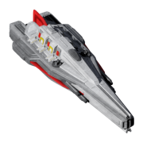
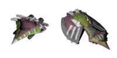

Any bugs or questions? Ping me on the [official Discord server](https://discord.gg/ZeuASSx).

A big thank you to Zuckung for this plugin repository template (get it [here](https://github.com/zuckung/endless-sky-plugins?tab=readme-ov-file#other-things)) and Nova1422 for helping me set it up.

## Latest News:
<table>
<tr>
<td> 
2026-02-11 | update: buyable_faesmar 
2025-12-25 | update: buyable_wanderer_ships 
2025-12-23 | update: KGS 
2025-12-22 | update: buyable_wanderer_ships 
2025-12-18 | update: buyable_unfettered_weapons 
2025-12-18 | update: buyable_faesmar 
2025-12-18 | update: KGS 
2025-12-17 | update: KGS 
2025-12-15 | update: more_small_weapons 
2025-12-15 | update: more_skipper_railguns 
 
</td>
</tr>
</table>

## Plugin List: 
<table>
<tr valign="top">
<td> 
<a href="https://github.com/kaiboyjiang/endless-sky-plugins?tab=readme-ov-file#KGS">KGS</a> 
<a href="https://github.com/kaiboyjiang/endless-sky-plugins?tab=readme-ov-file#buyable_faesmar">buyable_faesmar</a> 
 </td><td> 
<a href="https://github.com/kaiboyjiang/endless-sky-plugins?tab=readme-ov-file#buyable_unfettered_weapons">buyable_unfettered_weapons</a> 
 </td><td> 
<a href="https://github.com/kaiboyjiang/endless-sky-plugins?tab=readme-ov-file#buyable_wanderer_ships">buyable_wanderer_ships</a> 
 </td></tr></table>

---

### KGS

[KGS.zip](https://github.com/kaiboyjiang/endless-sky-plugins/releases/download/v1.0.4-KGS/KGS.zip) | 717.93 kb | 2025-12-23 | [view files](https://github.com/kaiboyjiang/endless-sky-plugins/tree/main/myplugins/KGS/) <a href="res/imagemd/KGS.md">view images</a> [18] 
 
>This plugin adds various merged stuff. All have been kitbashed in GIMP, and GIMP only.
>
>Hauler IV at all shipyards with the Hauler III.
>
>Twin Gatling, Twin Gatling (Staggered) at all outfitters with the regular Gatling Gun.
>Triple Gatling, Quad Gatling, 2x3 Gatling at all Kraz Advanced outfitters after a short mission chain.
>Javelin Launcher at all outfitters with the regular Javelin Pod.
>Twin Skipper Railgun, Triple Skipper Railgun, Quad Skipper Railgun, 2x3 Skipper Railgun, 3x3 Skipper Railgun, 3x4 Skipper Railgun, 4x4 Skipper Railgun, 4x5 Skipper Railgun at all outfitters with the regular Skipper Railgun.
>
>Made by kaiboy, assets are from endless-sky-high-dpi and edited by kaiboy.

:blue_book: Plugin readme

<blockquote>N/A</blockquote>

 

---

### buyable_faesmar

[buyable_faesmar.zip](https://github.com/kaiboyjiang/endless-sky-plugins/releases/download/v1.1.0-buyable_faesmar/buyable_faesmar.zip) | 121.25 kb | 2026-02-11 | [view files](https://github.com/kaiboyjiang/endless-sky-plugins/tree/main/myplugins/buyable_faesmar/) <a href="res/imagemd/buyable_faesmar.md">view images</a> [2] 
 
>Adds the Faes'mar to all Remnant shipyards.

:blue_book: Plugin readme

<blockquote># Buyable Faes'mar

Adds the Faes'mar to all Remnant shipyards.

## Changelog

- ### 1.1.0

  - New icon

  - Updated plugin.txt to be more descriptive

  - Added this readme

  - Removed an empty line at the end of license.txt

</blockquote>

 

---

### buyable_unfettered_weapons

[buyable_unfettered_weapons.zip](https://github.com/kaiboyjiang/endless-sky-plugins/releases/download/v1.0.1-buyable_unfettered_weapons/buyable_unfettered_weapons.zip) | 23.08 kb | 2025-12-18 | [view files](https://github.com/kaiboyjiang/endless-sky-plugins/tree/main/myplugins/buyable_unfettered_weapons/) <a href="res/imagemd/buyable_unfettered_weapons.md">view images</a> [1] 
 
>Adds the Tripulse Shredder, Ionic Blaster Prototype, and Ionic Turret Prototype to Darkcloak in the Wah Yoot system.
>
>Made by kaiboy.

:blue_book: Plugin readme

<blockquote>N/A</blockquote>

 

---

### buyable_wanderer_ships

[buyable_wanderer_ships.zip](https://github.com/kaiboyjiang/endless-sky-plugins/releases/download/v1.0.2-buyable_wanderer_ships/buyable_wanderer_ships.zip) | 23.88 kb | 2025-12-25 | [view files](https://github.com/kaiboyjiang/endless-sky-plugins/tree/main/myplugins/buyable_wanderer_ships/) <a href="res/imagemd/buyable_wanderer_ships.md">view images</a> [1] 
 
>Adds the Cool Breeze and Winter Gale to all Wanderer shipyards with the Strong Wind, some time after the completion of the Wanderer campaign.
>
>Made by kaiboy. Copied from Rumskib.

:blue_book: Plugin readme

<blockquote>N/A</blockquote>

 
