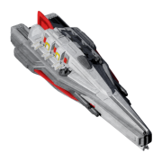
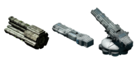
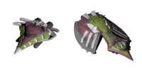
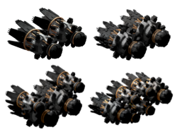

Any bugs or questions? Ping me on the [official Discord server](https://discord.gg/ZeuASSx).

A big thank you to Zuckung for this plugin repository template (get it [here](https://github.com/zuckung/endless-sky-plugins?tab=readme-ov-file#other-things)) and Nova1422 for helping me set it up.

## Latest News:
<table>
<tr>
<td> 
2026-04-23 | update: KGS 
2026-04-23 | update: wanderer_reverse_thrusters 
2026-04-23 | update: buyable_wanderer_ships 
2026-04-23 | update: buyable_unfettered_weapons 
2026-04-23 | update: buyable_faesmar 
2026-02-15 | update: wanderer_reverse_thrusters 
2026-02-11 | update: buyable_faesmar 
2025-12-25 | update: buyable_wanderer_ships 
2025-12-23 | update: KGS 
2025-12-22 | update: buyable_wanderer_ships 
 
</td>
</tr>
</table>

## Plugin List: 
<table>
<tr valign="top">
<td> 
<a href="https://github.com/kaiboyjiang/endless-sky-plugins?tab=readme-ov-file#KGS">KGS</a> 
<a href="https://github.com/kaiboyjiang/endless-sky-plugins?tab=readme-ov-file#buyable_faesmar">buyable_faesmar</a> 
 </td><td> 
<a href="https://github.com/kaiboyjiang/endless-sky-plugins?tab=readme-ov-file#buyable_unfettered_weapons">buyable_unfettered_weapons</a> 
<a href="https://github.com/kaiboyjiang/endless-sky-plugins?tab=readme-ov-file#buyable_wanderer_ships">buyable_wanderer_ships</a> 
 </td><td> 
<a href="https://github.com/kaiboyjiang/endless-sky-plugins?tab=readme-ov-file#wanderer_reverse_thrusters">wanderer_reverse_thrusters</a> 
 </td></tr></table>

---

### KGS

 |  | N/A | [view files](https://github.com/kaiboyjiang/endless-sky-plugins/tree/main/myplugins/KGS/) <a href="res/imagemd/KGS.md">view images</a> [408] 
 
>A vanilla+ content expansion plugin.
>
>See README.md for more details.
>Get the latest version here:
>github.com/kaiboyjiang/endless-sky-
>plugins

 README.md 

<blockquote>

# Kai's GIMPed Stuff

- [Ships](#ships)

- [Weapons](#weapons)

- [Releases](#releases)

- [About this plugin](#about)

A vanilla+ content expansion plugin for Endless Sky, containing 34 ships and 40 weapons.

## Ships

Human ships

- Dipper (Clipper kitbash)

- Eyas, Kingfisher, Kookaburra, and Fallcoon (Falcon kitbashes)

- Eyrie (Aerie variant)

- Hauler IV, V, VI, and VII

- Maker, Mistmaker, Stormmaker, and Raindrop (Rainmaker kitbashes)

- Nightingale (Raven kitbash)

- Sparrowhawk (Sparrow and Hawk kitbash)

- Stiletto (Dagger kitbash)

- Yestrel (Kestrel kitbash)

Remnant ships

- Silver variants of all Remnant ships

Korath ships

- Biolofez, Triolofez, and Yolofez ('olofez kitbashes)

Wanderer ships

- Rapid Stream (Deep River kitbash)

## Weapons

Human weapons

- Mini Blaster

- Particle Carronade

- Particle Howitzer

- Particle Burster

- Dual Particle Cannon

- Plasma Assault Repeater

- Particle Turret

- Javelin Micro Pod

- Javelin Launcher

- Javelin Storm Pod and Launcher

- Javelin Strike Pod and Launcher

- Javelin Micro Pod Deployer

- Twin, Staggered Twin, Triple, Quad, and 2x3 Gatling Gun

- Quad Gatling Turret

- Gatling Snubnose

- High Velocity Gatling Gun

- Twin Flamethrower

Hai weapons

- Hyperpulse Cannon

- Bipulse Ripper

- Twin, Triple, Quad, 2x3, 3x3, 3x4, 4x4, and 4x5 Skipper Railgun

Remnant weapons

- Twinhibitor

- Bithrasher

- Trithrasher

Korath weapons

- Binary Repeater

- Double Digger Mining Beam and Turret

Bunrodea weapons

- Twin Mandible Cannon

## Releases

 v2.0.1 (23 Apr 2026) 

The seventh release of KGS, released on the same day as v2.0.0, containing a hotfix removing the test system.

 v2.0.0 (23 Apr 2026) 

The sixth and largest ever release of KGS.

This release contains 34 ships and 40 weapons.

#### New ships

- Dipper (Clipper kitbash)

- Eyas, Kingfisher, Kookaburra, and Fallcoon (Falcon kitbashes)

- Eyrie (Aerie variant)

- Hauler V, VI, and VII

- Maker, Mistmaker, Stormmaker, and Raindrop (Rainmaker kitbashes)

- Nightingale (Raven kitbash)

- Sparrowhawk (Sparrow and Hawk kitbash)

- Stiletto (Dagger kitbash)

- Yestrel (Kestrel kitbash)

- Silver variants of all Remnant ships

- Biolofez, Triolofez, and Yolofez ('olofez kitbashes)

- Rapid Stream, along with its semi-empty variants (Deep River kitbash)

#### New weapons

- Mini Blaster

- Particle Carronade

- Particle Howitzer

- Particle Burster

- Dual Particle Cannon

- Plasma Assault Repeater

- Particle Turret

- Javelin Micro Pod

- Javelin Storm Pod and Launcher

- Javelin Strike Pod and Launcher

- Javelin Micro Pod Deployer

- Quad Gatling Turret

- Gatling Snubnose

- High Velocity Gatling Gun

- Twin Flamethrower

- Hyperpulse Cannon

- Bipulse Ripper

- Twinhibitor

- Bithrasher

- Trithrasher

- Binary Repeater

- Double Digger Mining Beam and Turret

- Twin Mandible Cannon

#### Other changes

- Fleets now use the new ships and variants

- Fixed the Hauler IV sprite, which had some ghost pixels

- Rewrote the Gatling mission chain with Barmy

- High-DPI support

I dedicate this release to the memory of Empty.

 v1.0.4 (22 Dec 2025) 

The fifth release of KGS.

This release contains 1 ship and 13 weapons.

- Triple, Quad, and 2x3 Gatling

- Javelin Launcher

- Added a short mission chain to unlock the Triple, Quad, and 2x3 Gatlings

 v1.0.3 (17 Dec 2025) 

The fourth release of KGS, released on the same day as v1.0.0, v1.0.1, and v1.0.2.

This release contains 1 ship and 9 weapons.

- Adjusted the turret hardpoints of the Hauler IV

 v1.0.2 (17 Dec 2025) 

The third release of KGS, released on the same day as v1.0.0 and v1.0.1.

This release contains 1 ship and 9 weapons.

- Fixes a typo in the description of the plugin

 v1.0.1 (17 Dec 2025) 

The second release of KGS, released on the same day as v1.0.0.

This release contains 1 ship and 9 weapons.

- Hauler IV

 v1.0.0 (17 Dec 2025) 

The first release of KGS, merging More Gatling Guns and More Skipper Railguns.

This release contains 0 ships and 9 weapons.

## About

Made by kaiboy (aka k.AI). All sprites kitbashed by k.AI with the GIMP.

 Idea/stat/name credits: 

- 'olofezes (Ludmina)

- Binary Repeater (Zoura)

- Digger Mining Beam derivatives (Ludmina)

- Dual Particle Cannon (Lunella)

- Fallcoon (Ferociousfeind, timeout)

- Gatling Guns (Ludmina)

- Haulers (Nova)

- Javelin Micro Pod Deployer (Zoura)

- Maker (Kitteh)

- Nightingale (Lunella)

- Particle Carronade (Kitteh)

- silver Remnant ships (Claudiu)

- Skipper Railgun derivatives (Nana)

- Stormmaker (Lowry)

- Yolofez (Fluora)

 Thanks to these people who provided ideas, encouragement, and help: 

- my big brother

- Airhead

- Bubba

- Claudiu

- Cracked Emerald

- Eggapegawsus

- failure

- Ferociousfeind

- Fluora

- Kassandra Haruki

- Kitteh

- 🤖Isaias🤖#0395

- Lowry

- Loymdayddaud

- Ludmina

- Lunella

- Nana

- Nova

- Nuke Guy

- Quarg Block

- RedTechGamer236

- Sachiho Vanihalla

- the114dragon

- timeout

- Zoura

- zuckung

</blockquote>

 

---

### buyable_faesmar

 |  | N/A | [view files](https://github.com/kaiboyjiang/endless-sky-plugins/tree/main/myplugins/buyable_faesmar/) <a href="res/imagemd/buyable_faesmar.md">view images</a> [2] 
 
>Adds the Faes'mar to all Remnant shipyards.
>
>See README.md for more details.
>Get the latest version here:
>github.com/kaiboyjiang/endless-sky-
>plugins

 README.md 

<blockquote>

# Buyable Faes'mar

Adds the Faes'mar to all Remnant shipyards.

## Releases

 v1.1.1 (23 Apr 2026) 

- Shiny new download button

- Reverted icon because it was soft

 v1.1.0 (11 Feb 2026) 

- New icon

- Updated plugin.txt to be more descriptive

- Added this readme

- Removed an empty line at the end of license.txt

</blockquote>

 

---

### buyable_unfettered_weapons

 |  | N/A | [view files](https://github.com/kaiboyjiang/endless-sky-plugins/tree/main/myplugins/buyable_unfettered_weapons/) <a href="res/imagemd/buyable_unfettered_weapons.md">view images</a> [2] 
 
>Adds the Tripulse Shredder, Ionic Blaster Prototype, and Ionic Turret Prototype to Darkcloak in the Wah Yoot system.
>
>See README.md for more details.
>Get the latest version here:
>github.com/kaiboyjiang/endless-sky-
>plugins

 README.md 

<blockquote>

# Buyable Unfettered Weapons

Adds the Tripulse Shredder, Ionic Blaster Prototype, and Ionic Turret Prototype to Darkcloak in the Wah Yoot system.

## Releases

 v1.1.0 (23 Apr 2026) 

- Shiny new download button

- 2x icon

- Updated plugin.txt to be more descriptive

- Added this readme

- Updated license

</blockquote>

 

---

### buyable_wanderer_ships

 |  | N/A | [view files](https://github.com/kaiboyjiang/endless-sky-plugins/tree/main/myplugins/buyable_wanderer_ships/) <a href="res/imagemd/buyable_wanderer_ships.md">view images</a> [2] 
 
>Adds the Cool Breeze and Winter Gale to all Wanderer shipyards with the Strong Wind, some time after the completion of the Wanderer campaign.
>
>See README.md for more details.
>Get the latest version here:
>github.com/kaiboyjiang/endless-sky-
>plugins

 README.md 

<blockquote>

# Buyable Wanderer Ships

Adds the Cool Breeze and Winter Gale to all Wanderer shipyards with the Strong Wind, some time after the completion of the Wanderer campaign.

Missions partially copied from Rumskib.

## Releases

 v1.1.0 (23 Apr 2026) 

- Shiny new download button

- 2x icon

- Modified fleets

- Updated plugin.txt to be more descriptive

- Added this readme

- Updated license

</blockquote>

 

---

### wanderer_reverse_thrusters

 |  | N/A | [view files](https://github.com/kaiboyjiang/endless-sky-plugins/tree/main/myplugins/wanderer_reverse_thrusters/) <a href="res/imagemd/wanderer_reverse_thrusters.md">view images</a> [10] 
 
>Adds Wanderer reverse thrusters.
>
>See README.md for more details.
>Get the latest version here:
>github.com/kaiboyjiang/endless-sky-
>plugins

 README.md 

<blockquote>

# Wanderer Reverse Thrusters

Adds reverse versions of Wanderer thrusters to wherever the original thrusters are sold.

Idea by Ubrief. Artwork and stats by Ubrief and k.AI.

## Releases

 v1.0.1 

Shiny new download button.

 v1.0.0 

First release.

</blockquote>

 
